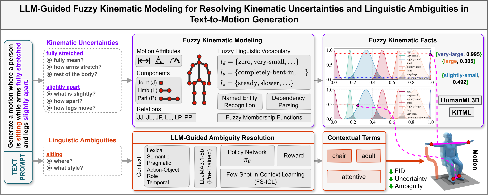

# LLM-FQK-T2M: LLM-Guided Fuzzy Kinematic Modeling for Resolving Kinematic Uncertainties and Linguistic Ambiguities in Text-to-Motion Generation


The official PyTorch implementation of the paper [**"LLM-Guided Fuzzy Kinematic Modeling for Resolving Kinematic Uncertainties and Linguistic Ambiguities in Text-to-Motion Generation"**](https://alimanjotho.github.io/llm-fqk-t2m/).

Please visit our [**webpage**](https://alimanjotho.github.io/llm-fqk-t2m/) for more details.




## Getting started

This code was tested on `Windows11 24H2` and requires:

* Python 3.7
* conda3 or miniconda3
* CUDA capable GPU (one is enough)

### 1. Setup FFMPEG
Download ffmpeg from https://www.ffmpeg.org/download.html#build-windows
Extract it in `C:\ffmpeg`.
Add `C:\ffmpeg\bin` in `PATH` environment variable.


### 2. Setup miniconda environment
```shell
conda env create -f environment.yml
conda activate cmdm
python -m spacy download en_core_web_sm
pip install git+https://github.com/openai/CLIP.git
```

Download dependencies:

```bash
bash protos/smpl_files.sh
bash protos/glove.sh
bash protos/t2m_evaluators.sh
```


### 3. Get datasets
There are two paths to get the data:

(a) **Go the easy way if** you just want to generate text-to-motion (excluding editing which does require motion capture data)

(b) **Get full data** to train and evaluate the model.


#### a. The easy way (text only)

**HumanML3D** - Clone HumanML3D, then copy the data dir to our repository:

```shell
cd ..
git clone https://github.com/EricGuo5513/HumanML3D.git
unzip ./HumanML3D/HumanML3D/texts.zip -d ./HumanML3D/HumanML3D/
cp -r HumanML3D/HumanML3D llm-fqk-t2m/dataset/HumanML3D
cd llm-fqk-t2m
```


#### b. Full data (text + motion capture)

**HumanML3D** - Follow the instructions in [HumanML3D](https://github.com/EricGuo5513/HumanML3D.git),
then copy the result dataset to our repository:

```shell
cp -r ../HumanML3D/HumanML3D ./dataset/HumanML3D
```

**KIT** - Download from [HumanML3D](https://github.com/EricGuo5513/HumanML3D.git) (no processing needed this time) and the place result in `./dataset/KIT-ML`


### 4. Get the pretrained models

Download the pretrained models and place then unzip and place them in `./checkpoints/`. 


**HumanML3D**

[cmdm_humanml3d](https://drive.google.com/file/d/1JrVp4zO-gOYJAadhF1i_JemJje7Wzuw6/view?usp=sharing) - Runs 20X faster with comparable performance!


**KIT**

[cmdm_kitml](https://drive.google.com/file/d/1SHCRcE0es31vkJMLGf9dyLe7YsWj7pNL/view?usp=sharing)


## Motion Generation

### Generate from a single prompt

```shell
python -m sample_cmdm.sample --model_path ./checkpoints/cmdm_humanml3d_000294000/cmdm_humanml3d_000294000.pt --text_prompt "a person is jumping on floor" --cuda True --motion_length 9
```

### Generate from test set prompts

```shell
python -m sample_cmdm.sample --model_path ./checkpoints/cmdm_humanml3d_000294000/cmdm_humanml3d_000294000.pt --num_samples 10 --num_repetitions 3
```

### Generate from text file

```shell
python -m sample_cmdm.sample --model_path ./checkpoints/cmdm_humanml3d_000294000/cmdm_humanml3d_000294000.pt --input_text ./assets/sample_prompts.txt
```


**You may also define:**
* `--device` id.
* `--seed` to sample different prompts.
* `--motion_length` in seconds (maximum is 9.8[sec]).

**Running those will get you:**

* `motions.npy` file with text prompts and xyz positions of the generated animation
* `prompt##_rep##.mp4` - a stick figure animation for each generated motion.

It will look something like this:


You can stop here, or render the SMPL mesh using the following script.

### Render SMPL mesh

To create SMPL mesh per frame run:

```shell
python -m visualize.render_mesh --input_path /path/to/mp4/stick/figure/file
```

**This script outputs:**
* `prompt##_rep##_smpl_params.npy` - SMPL parameters (thetas, root translations, vertices and faces)
* `prompt##_rep##_obj` - Mesh per frame in `.obj` format.

**Notes:**
* The `.obj` can be integrated into Blender/Maya/3DS-MAX and rendered using them.
* This script is running [SMPLify](https://smplify.is.tue.mpg.de/) and needs GPU as well (can be specified with the `--device` flag).
* **Important** - Do not change the original `.mp4` path before running the script.

**Notes for 3d makers:**
* You have two ways to animate the sequence:
  1. Use the [SMPL add-on](https://smpl.is.tue.mpg.de/index.html) and the theta parameters saved to `sample##_rep##_smpl_params.npy` (we always use beta=0 and the gender-neutral model).
  1. A more straightforward way is using the mesh data itself. All meshes have the same topology (SMPL), so you just need to keyframe vertex locations. 
     Since the OBJs are not preserving vertices order, we also save this data to the `sample##_rep##_smpl_params.npy` file for your convenience.


## Train CMDM

**HumanML3D**
```shell
python -m train.train_cmdm --save_dir checkpoints/cmdm_humanml3d_1 --dataset humanml
```

**KIT**
```shell
python -m train.train_cmdm --save_dir checkpoints/cmdm_kitml_1 --dataset kit
```


* Use `--diffusion_steps 200` to train the faster model with less diffusion steps.
* Use `--device` to define GPU id.
* Add `--eval_during_training` to run a short (90 minutes) evaluation for each saved checkpoint. 
  This will slow down training but will give you better monitoring.

## Evaluation

* Takes about 20 hours (on a single GPU)
* The output of this script for the pre-trained models (as was reported in the paper) is provided in the checkpoints zip file.

**HumanML3D**
```shell
python -m evaluations.eval_humanml --model_path ./checkpoints/cmdm_humanml3d_000294000/cmdm_humanml3d_000294000.pt
```

**KIT**
```shell
python -m evaluations.eval_humanml --model_path ./checkpoints/cmdm_kitml_000294000/cmdm_kitml_000294000.pt
```


Download Blender Animation Files:

https://drive.google.com/file/d/1EbUkwPCt7eB9HAZXtM-nCxsztkfsRImD/view?usp=sharing


## Bibtex
```
@article{
manjotho2025llmfqkt2m,
title={LLM-Guided Fuzzy Kinematic Modeling for Resolving Kinematic Uncertainties and Linguistic Ambiguities in Text-to-Motion Generation},
author={Ali Asghar Manjotho and Tekie Tsegay Tewolde and Ramadhani Ally Duma and Zhendong Niu},
journal={Expert Systems With Applications},
year={2025}
}
```


## Acknowledgments

This code is standing on the shoulders of giants. We want to thank the following contributors
that our code is based on:

[guided-diffusion](https://github.com/openai/guided-diffusion), [MotionCLIP](https://github.com/GuyTevet/MotionCLIP), [text-to-motion](https://github.com/EricGuo5513/text-to-motion), [actor](https://github.com/Mathux/ACTOR), [joints2smpl](https://github.com/wangsen1312/joints2smpl), [MoDi](https://github.com/sigal-raab/MoDi).

## License
This code is distributed under an [MIT LICENSE](LICENSE).

Note that our code depends on other libraries, including CLIP, SMPL, SMPL-X, PyTorch3D, and uses datasets that each have their own respective licenses that must also be followed.
